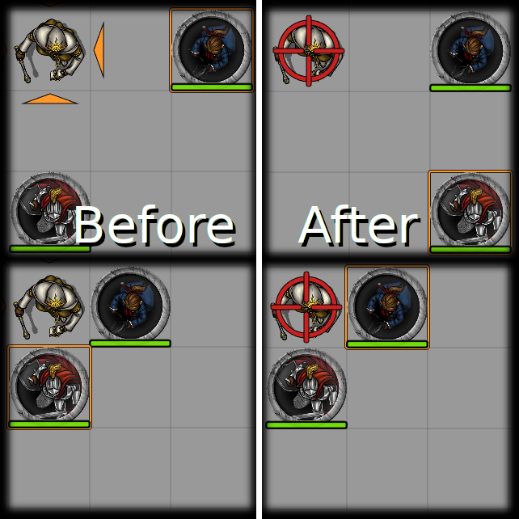

# Foundry VTT - Better Target

The default target indicator can be difficult to see in tight confines, or crowded rooms. This module changes the target indicator to a crosshair that renders over the targeted token.

NOTE: There's no easy way to update the target graphics, so this module overrides the entire function that draws it. This is somewhat prone to breakage across Foundry versions, but I'll endevour to keep it up to date and compatible.

